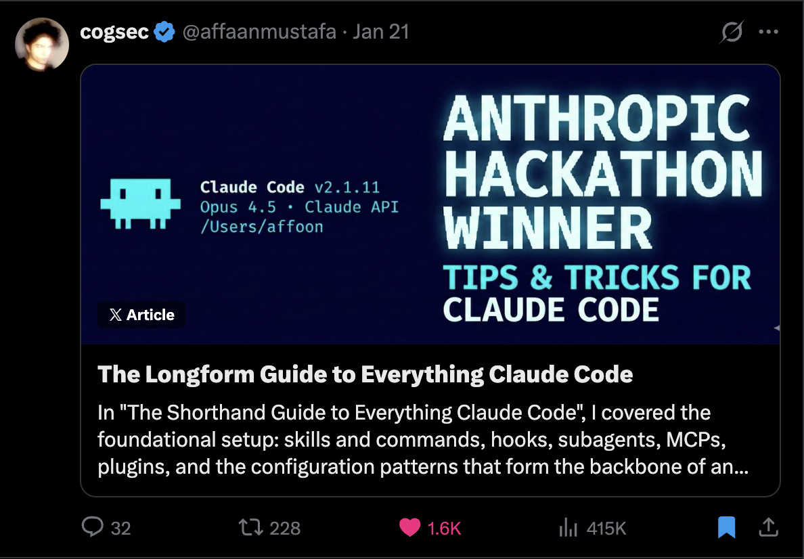
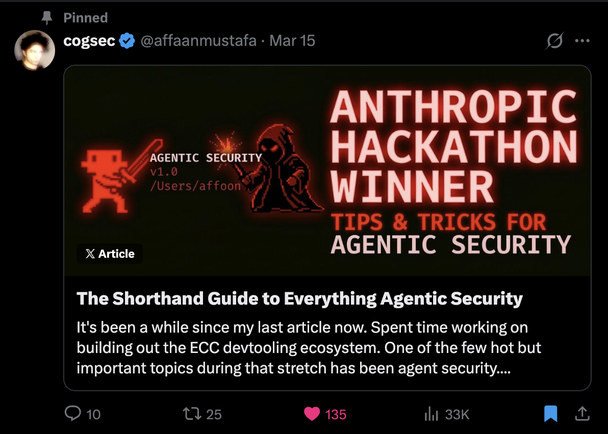

**Language:** [English](README.md) | [Português (Brasil)](docs/pt-BR/README.md) | [简体中文](README.zh-CN.md) | [繁體中文](docs/zh-TW/README.md) | 日本語 | [한국어](docs/ko-KR/README.md) | [Türkçe](docs/tr/README.md) | [Русский](docs/ru/README.md) | [Tiếng Việt](docs/vi-VN/README.md) | [ไทย](docs/th/README.md)

# Everything Claude Code

> **182K+ stars** | **28K+ forks** | **170+ contributors** | **12+ language ecosystems** | **Anthropic Hackathon Winner**

---

**Language / 语言 / 語言 / Dil / Язык / Ngôn ngữ**

[English](README.md) | [Português (Brasil)](docs/pt-BR/README.md) | [简体中文](README.zh-CN.md) | [繁體中文](docs/zh-TW/README.md) | **日本語** | [한국어](docs/ko-KR/README.md)
 | [Türkçe](docs/tr/README.md) | [Русский](docs/ru/README.md) | [Tiếng Việt](docs/vi-VN/README.md) | [ไทย](docs/th/README.md)

---

**AI Agent Harness のためのパフォーマンス最適化システム。Anthropic ハッカソンの優勝者による提供である。**

単なる設定ではない。スキル、直感（instincts）、メモリの最適化、継続的学習、セキュリティスキャン、そして研究優先（research-first）の開発を含む完全なシステムである。10ヶ月以上の実際のプロダクト構築における集中的な日常使用を通じて進化した、プロダクションレディな Agent、スキル、Hook、Rule、MCP 構成、およびレガシーな Command シムである。

**Claude Code**、**Codex**、**Cursor**、**OpenCode**、**Gemini**、**Zed**、**GitHub Copilot**、その他の AI Agent Harness 全体で動作する。

ECC v2.0.0-rc.1 は、その再利用可能なレイヤーの上にパブリックな Hermes operator のストーリーを追加する：まず [Hermes setup guide](docs/HERMES-SETUP.md) から始め、次に [rc.1 release notes](docs/releases/2.0.0-rc.1/release-notes.md) と [cross-harness architecture](docs/architecture/cross-harness.md) を確認すること。

---

<table>
<tr>
<td width="25%" align="center">
  <a href="https://ecc.tools/pricing">
    <strong> ECC Pro</strong> 
    Private repos · GitHub App · $19/seat/mo
  </a>
</td>
<td width="25%" align="center">
  <a href="https://github.com/sponsors/affaan-m">
    <strong> Sponsor</strong> 
    Fund the OSS · From $5/mo
  </a>
</td>
<td width="25%" align="center">
  <a href="https://github.com/affaan-m/everything-claude-code/discussions">
    <strong>Community</strong>
     
    Discussions · Q&amp;A · Show & Tell
  </a>
</td>
<td width="25%" align="center">
  <a href="https://github.com/apps/ecc-tools">
    <strong> GitHub App</strong> 
    Install · PR audits · Free tier
  </a>
</td>
</tr>
</table>

**OSS は常に無料である。** このリポジトリは永久に MIT ライセンスである。ECC Pro はプライベートリポジトリ用のホスト型 GitHub App である。<a href="https://github.com/sponsors/affaan-m">Sponsors</a> と <a href="https://ecc.tools/pricing">Pro subscribers</a> がこの作業の資金を提供しており、それゆえに一人のメンテナーが7つの Harness にわたって毎週リリースできている。

---

## The Guides

このリポジトリは生のコードのみである。以下のガイドですべてを説明している。

<table>
<tr>
<td width="33%">

</td>
<td width="33%">

</td>
<td width="33%">

</td>
</tr>
<tr>
<td align="center"><b>Shorthand Guide</b> セットアップ、基礎、哲学。<b>最初にこれを読むこと。</b></td>
<td align="center"><b>Longform Guide</b> Token の最適化、メモリの永続化、評価（evals）、並列化。</td>
<td align="center"><b>Security Guide</b> 攻撃ベクトル、Sandboxing、サニタイゼーション、CVE、AgentShield。</td>
</tr>
</table>

| Topic | What You'll Learn |
|-------|-------------------|
| Token Optimization | Model の選択、System Prompt のスリム化、バックグラウンドプロセス |
| Memory Persistence | セッション間で Context を自動的に保存/読み込みする Hook |
| Continuous Learning | セッションからパターンを再利用可能な Skill に自動抽出する |
| Verification Loops | チェックポイントと継続的な評価（evals）、グレーダー（grader）タイプ、pass@k 指標 |
| Parallelization | Git worktrees、cascade メソッド、インスタンスをスケールするタイミング |
| Subagent Orchestration | Context の問題、反復的な検索（retrieval）パターン |

---

## What's New

### v2.0.0-rc.1 — Surface Refresh, Operator Workflows, and ECC 2.0 Alpha (Apr 2026)

- **Dashboard GUI** — 新しい Tkinter ベースのデスクトップアプリケーション（`ecc_dashboard.py` または `npm run dashboard`）。ダーク/ライトテーマの切り替え、フォントのカスタマイズ、ヘッダーとタスクバーのプロジェクトロゴを備えている。
- **ライブリポジトリと同期されたパブリックサーフェス** — メタデータ、カタログ数、Plugin Manifest、インストール向けドキュメントが実際の OSS サーフェス（60の Agent、231の Skill、75のレガシーな Command シム）と一致するようになった。
- **Operator とアウトバウンドワークフローの拡張** — `brand-voice`、`social-graph-ranker`、`connections-optimizer`、`customer-billing-ops`、`ecc-tools-cost-audit`、`google-workspace-ops`、`project-flow-ops`、`workspace-surface-audit` により、Operator のレーンが完成した。
- **Media とローンチツール** — `manim-video`、`remotion-video-creation`、アップグレードされたソーシャルパブリッシングサーフェスにより、技術的な説明やローンチコンテンツが同一システムの一部となった。
- **フレームワークとプロダクトサーフェスの成長** — `nestjs-patterns`、よりリッチな Codex/OpenCode インストールサーフェス、拡張されたクロス Harness のパッケージングにより、Claude Code にとどまらずリポジトリの可用性が維持されている。
- **ECC 2.0 alpha をインツリーに** — `ecc2/` にある Rust コントロールプレーンのプロトタイプがローカルでビルドされ、`dashboard`、`start`、`sessions`、`status`、`stop`、`resume`、`daemon` コマンドが公開された。これはアルファ版として使用可能であり、まだ一般リリースではない。
