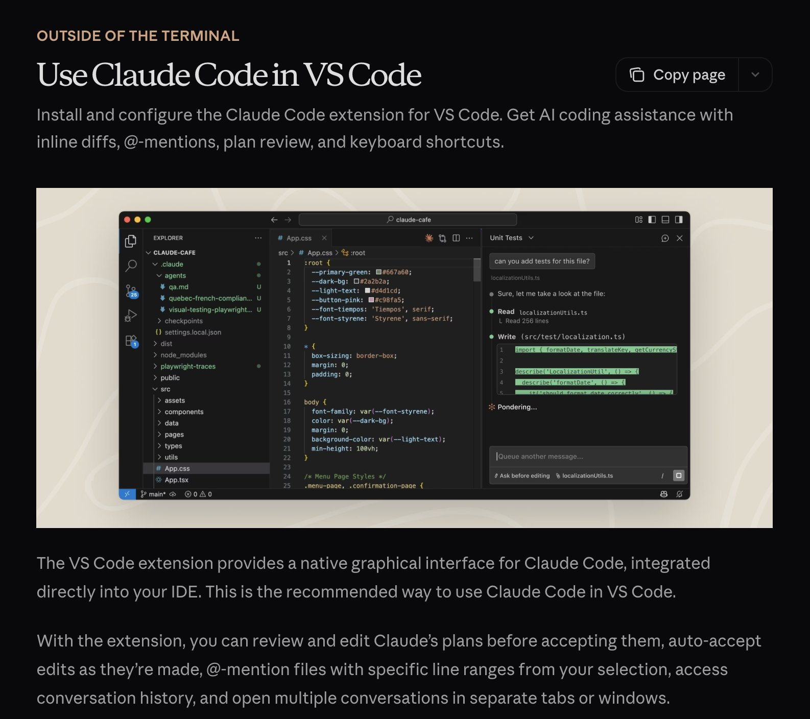

# Everything Claude Code — 簡略版ガイド (The Shorthand Guide)

*このガイドは、`github.com/affaan-m/everything-claude-code/tree/main/hooks/memory-persistence` にあるリポジトリのコードを使用して実装することができる。*

---

## プラグイン (Plugins)

**LSP プラグイン** は、エディタの外部で Claude Code を頻繁に実行する場合に特に便利である。Language Server Protocol（言語サーバープロトコル）により、IDE を開かなくても、Claude はリアルタイムの型チェック、定義への移動（go-to-definition）、およびインテリジェントな補完を行うことができる。

```bash
# 有効なプラグインの例
typescript-lsp@claude-plugins-official  # TypeScript インテリジェンス
pyright-lsp@claude-plugins-official     # Python 型チェック
hookify@claude-plugins-official         # 会話形式でのフック作成
mgrep@Mixedbread-Grep                   # ripgrep よりも優れた検索
```

MCP と同じ警告 — コンテキストウィンドウに注意すること。

---

## ヒントとコツ (Tips and Tricks)

### キーボードショートカット (Keyboard Shortcuts)

- `Ctrl+U` - 行全体を削除する（バックスペースを連打するより速い）
- `!` - クイック bash コマンドプレフィックス
- `@` - ファイルを検索する
- `/` - スラッシュコマンドを開始する
- `Shift+Enter` - 複数行入力
- `Tab` - 思考（thinking）表示の切り替え
- `Esc Esc` - Claude を中断する / コードを復元する

### 並行ワークフロー (Parallel Workflows)

- **Fork** (`/fork`) - 会話をフォークして、キューに入れられたメッセージをスパムする代わりに、重複しないタスクを並行して実行する
- **Git Worktrees** - 競合することなく Claude を並行してオーバーラップさせるための機能。各ワークツリーは独立したチェックアウトである。

```bash
git worktree add ../feature-branch feature-branch
# これで、各ワークツリーで別々の Claude インスタンスを実行できる
```

### 長時間実行コマンド用の tmux (tmux for Long-Running Commands)

Claude が実行するログ/bash プロセスをストリーミングして監視する:

<https://github.com/user-attachments/assets/shortform/07-tmux-video.mp4>

```bash
tmux new -s dev
# Claude はここでコマンドを実行する。デタッチして再アタッチできる
tmux attach -t dev
```

### mgrep > grep

`mgrep` は ripgrep/grep からの大きな改善である。プラグインマーケットプレイスからインストールし、`/mgrep` スキルを使用する。ローカル検索とウェブ検索の両方で機能する。

```bash
mgrep "function handleSubmit"  # ローカル検索
mgrep --web "Next.js 15 app router changes"  # ウェブ検索
```

### その他の便利なコマンド (Other Useful Commands)

- `/rewind` - 前の状態に戻る
- `/statusline` - ブランチ、コンテキストの %、TODO でカスタマイズする
- `/checkpoints` - ファイルレベルの取り消し（undo）ポイント
- `/compact` - コンテキストのコンパクション（整理）を手動でトリガーする

### GitHub Actions CI/CD

GitHub Actions で PR のコードレビューを設定する。設定すると、Claude は PR を自動的にレビューできる。


*バグ修正 PR を承認する Claude*

### サンドボックス (Sandboxing)

リスクの高い操作にはサンドボックスモードを使用する - Claude は、実際のシステムに影響を与えることなく、制限された環境で実行される。

---

## エディタについて (On Editors)

エディタの選択は、Claude Code のワークフローに大きな影響を与える。Claude Code はどのターミナルからでも機能するが、高機能なエディタと組み合わせることで、リアルタイムのファイル追跡、迅速なナビゲーション、統合されたコマンド実行が可能になる。

### Zed（私の好み） (Zed - My Preference)

私は [Zed](https://zed.dev) を使用している。Rust で書かれているため、本当に高速である。瞬時に開き、大規模なコードベースも難なく処理し、システムリソースをほとんど消費しない。

**Zed + Claude Code が素晴らしい組み合わせである理由:**

- **Speed** - Rust ベースのパフォーマンスにより、Claude がファイルを急速に編集しているときでも遅延がない。エディタが追いつく。
- **Agent Panel Integration** - Zed の Claude 統合により、Claude が編集しているときにファイルの変更をリアルタイムで追跡できる。エディタを離れることなく、Claude が参照しているファイル間をジャンプできる。
- **CMD+Shift+R Command Palette** - 検索可能な UI で、すべてのカスタムスラッシュコマンド、デバッガー、ビルドスクリプトにすばやくアクセスできる。
- **Minimal Resource Usage** - 重い操作中に Claude と RAM/CPU を競合しない。Opus を実行する場合に重要である。
- **Vim Mode** - 好みであれば、完全な vim キーバインディングが利用できる。


*CMD+Shift+R を使用したカスタムコマンドドロップダウンを備えた Zed エディタ。右下に「追跡モード（Following mode）」がターゲットマーク（bullseye）として表示されている。*

**エディタに依存しないヒント (Editor-Agnostic Tips):**

1. **画面を分割する (Split your screen)** - 片方に Claude Code を実行するターミナル、もう片方にエディタを配置する
2. **Ctrl + G** - Claude が現在作業しているファイルを Zed で素早く開く
3. **自動保存 (Auto-save)** - 自動保存を有効にして、Claude のファイル読み取りが常に最新になるようにする
4. **Git 統合 (Git integration)** - コミットする前に、エディタの git 機能を使用して Claude の変更をレビューする
5. **ファイルウォッチャー (File watchers)** - ほとんどのエディタは変更されたファイルを自動的に再読み込みする。これが有効になっていることを確認する。

### VSCode / Cursor

これも実行可能な選択肢であり、Claude Code とうまく機能する。ターミナル形式のいずれかで使用し、`\ide` を使用してエディタと自動同期させることで LSP 機能を有効にすることができる（現在ではプラグインとやや重複している）。または、エディタにより統合され、UI が一致している拡張機能を選択することもできる。


*VS Code 拡張機能は、IDE に直接統合された Claude Code 用のネイティブなグラフィカルインターフェースを提供する。*

---

## 私のセットアップ (My Setup)

### プラグイン (Plugins)

**インストール済み:** （通常、これらを一度に4〜5個だけ有効にしている）

```markdown
ralph-wiggum@claude-code-plugins       # ループの自動化
frontend-patterns@claude-code-plugins  # UI/UX パターン
commit-commands@claude-code-plugins    # Git ワークフロー
security-guidance@claude-code-plugins  # セキュリティチェック
pr-review-toolkit@claude-code-plugins  # PR の自動化
typescript-lsp@claude-plugins-official # TS インテリジェンス
hookify@claude-plugins-official        # フックの作成
code-simplifier@claude-plugins-official
feature-dev@claude-code-plugins
explanatory-output-style@claude-code-plugins
code-review@claude-code-plugins
context7@claude-plugins-official       # ライブドキュメント
pyright-lsp@claude-plugins-official    # Python の型
mgrep@Mixedbread-Grep                  # より良い検索
```

### MCP サーバー (MCP Servers)

**設定済み（ユーザーレベル）:**

```json
{
  "github": { "command": "npx", "args": ["-y", "@modelcontextprotocol/server-github"] },
  "firecrawl": { "command": "npx", "args": ["-y", "firecrawl-mcp"] },
  "supabase": {
    "command": "npx",
    "args": ["-y", "@supabase/mcp-server-supabase@latest", "--project-ref=YOUR_REF"]
  },
  "memory": { "command": "npx", "args": ["-y", "@modelcontextprotocol/server-memory"] },
  "sequential-thinking": {
    "command": "npx",
    "args": ["-y", "@modelcontextprotocol/server-sequential-thinking"]
  },
  "vercel": { "type": "http", "url": "https://mcp.vercel.com" },
  "railway": { "command": "npx", "args": ["-y", "@railway/mcp-server"] },
  "cloudflare-docs": { "type": "http", "url": "https://docs.mcp.cloudflare.com/mcp" },
  "cloudflare-workers-bindings": {
    "type": "http",
    "url": "https://bindings.mcp.cloudflare.com/mcp"
  },
  "clickhouse": { "type": "http", "url": "https://mcp.clickhouse.cloud/mcp" },
  "AbletonMCP": { "command": "uvx", "args": ["ableton-mcp"] },
  "magic": { "command": "npx", "args": ["-y", "@magicuidesign/mcp@latest"] }
}
```

これが重要な点である - 私は14個の MCP を設定しているが、プロジェクトごとに有効にしているのは5〜6個だけである。これにより、コンテキストウィンドウを健全に保つことができる。

### 主要なフック (Key Hooks)

```json
{
  "PreToolUse": [
    { "matcher": "npm|pnpm|yarn|cargo|pytest", "hooks": ["tmux reminder"] },
    { "matcher": "Write && .md file", "hooks": ["block unless README/CLAUDE"] },
    { "matcher": "git push", "hooks": ["open editor for review"] }
  ],
  "PostToolUse": [
    { "matcher": "Edit && .ts/.tsx/.js/.jsx", "hooks": ["prettier --write"] },
    { "matcher": "Edit && .ts/.tsx", "hooks": ["tsc --noEmit"] },
    { "matcher": "Edit", "hooks": ["grep console.log warning"] }
  ],
  "Stop": [
    { "matcher": "*", "hooks": ["check modified files for console.log"] }
  ]
}
```

### カスタムステータスライン (Custom Status Line)

ユーザー、ディレクトリ、ダーティインジケーター付きの git ブランチ、コンテキストの残りの %、モデル、時間、および TODO の数を表示する:


*私の Mac のルートディレクトリでのステータスラインの例*

```
affoon:~ ctx:65% Opus 4.5 19:52
▌▌ plan mode on (shift+tab to cycle)
```

### ルールの構造 (Rules Structure)

```
~/.claude/rules/
  security.md      # 必須のセキュリティチェック
  coding-style.md  # Immutability、ファイルサイズ制限
  testing.md       # TDD、80% カバレッジ
  git-workflow.md  # Conventional commits
  agents.md        # サブエージェントの委譲ルール
  patterns.md      # API レスポンスのフォーマット
  performance.md   # モデルの選択 (Haiku vs Sonnet vs Opus)
  hooks.md         # フックのドキュメント
```

### サブエージェント (Subagents)

```
~/.claude/agents/
  planner.md           # 機能を分解する
  architect.md         # システム設計
  tdd-guide.md         # 最初にテストを書く
  code-reviewer.md     # 品質レビュー
  security-reviewer.md # 脆弱性スキャン
  build-error-resolver.md
  e2e-runner.md        # Playwright テスト
  refactor-cleaner.md  # デッドコードの削除
  doc-updater.md       # ドキュメントを同期させる
```

---

## 重要なポイント (Key Takeaways)

1. **複雑にしすぎない (Don't overcomplicate)** - 設定はアーキテクチャではなく、微調整（fine-tuning）として扱うこと
2. **コンテキストウィンドウは貴重である (Context window is precious)** - 使用していない MCP やプラグインは無効にする
3. **並列実行 (Parallel execution)** - 会話をフォークし、git ワークツリーを使用する
4. **繰り返しを自動化する (Automate the repetitive)** - フォーマット、lint 実行、リマインダーのためのフック
5. **サブエージェントをスコープする (Scope your subagents)** - 限られたツール = 焦点を絞った実行

---

## 参考文献 (References)

- [Plugins Reference](https://code.claude.com/docs/en/plugins-reference)
- [Hooks Documentation](https://code.claude.com/docs/en/hooks)
- [Checkpointing](https://code.claude.com/docs/en/checkpointing)
- [Interactive Mode](https://code.claude.com/docs/en/interactive-mode)
- [Memory System](https://code.claude.com/docs/en/memory)
- [Subagents](https://code.claude.com/docs/en/sub-agents)
- [MCP Overview](https://code.claude.com/docs/en/mcp-overview)

---

**注:** これは詳細のサブセットである。高度なパターンについては [ロングフォームガイド (Longform Guide)](./the-longform-guide.md) を参照のこと。

---

*NYC で開催された Anthropic x Forum Ventures ハッカソンで、[@DRodriguezFX](https://x.com/DRodriguezFX) と共に [zenith.chat](https://zenith.chat) を構築し優勝した。*
